# ClinicSirius - Система управления клиникой
## Проект студента К0709-23/3 Ефимова Артёма


ClinicSirius - это веб-система управления медицинской клиникой, разработанная на Django. Система предназначена как для внутреннего контроля и управления (врачи, администраторы), так и внешнего взаимодействия с системой (пациенты, их семьи) для записи на прием, получения результатов анализов и тд.

## Фичи

- **Управление пользователями и аутентификация**
  - Регистрация и авторизация пользователей с поддержкой JWT
  - Система ролей: пациенты, врачи, менеджеры, администраторы
  - Управление профилями пользователей

- **Управление пациентами**
  - Создание и редактирование профилей пациентов
  - Хранение медицинских данных (СНИЛС, ОМС)
  - Система семейных связей (родители/дети)
  - Пригласительные коды для связи семейных профилей

- **Управление врачами и специализациями**
  - Регистрация врачей с привязкой к специализациям
  - Профили врачей с полной информацией
  - Личные кабинеты врачей

- **Система записи на приёмы**
  - Создание расписания работы врачей
  - Бронирование слотов для приёмов
  - Управление статусами приёмов (забронировано, в процессе, завершено, отменено)
  - Привязка к кабинетам

- **Управление рецептами и диагнозами**
  - Выписывание рецептов после приёма
  - База диагнозов
  - Возможность записи на повторный приём или направление к другому врачу

- **Административная панель**
  - Полное управление всеми сущностями системы
  - Аналитика и статистика
  - Управление расписанием врачей

## Стек

### Бэкенд
- **Python** - основной язык программирования
- **Django** - веб-фреймворк
- **Django REST Framework** - для создания REST API
- **Django REST Framework Simple JWT** - аутентификация через JWT токены
- **PostgreSQL** - реляционная база данных
- **psycopg2-binary** - драйвер для работы с PostgreSQL
- **python-dotenv** - для управления переменными окружения

### Фронтенд
- **HTML5/CSS3** - верстка
- **Django Templates** - шаблонизация
- **JavaScript** - интерактивность (встроенный в шаблоны)

### Контейнеризация
- **Docker & Docker Compose** 

## Установка и деплой

### Требования
- Python 3.8+
- PostgreSQL 12+ (или Docker для запуска через docker-compose)
- pip (менеджер пакетов Python)

### Пошаговая инструкция

1. **Клонирование репозитория**
   ```bash
   git clone https://github.com/vinotq/clinicSiriusDjango.git
   cd clinicSirius
   ```

2. **Создание виртуального окружения**
   ```bash
   cd backend
   python -m venv venv
   
   # Для Linux/Mac:
   source venv/bin/activate
   
   # Для Windows:
   venv\Scripts\activate
   ```

3. **Установка зависимостей**
   ```bash
   pip install -r requirements.txt
   ```

4. **Настройка переменных окружения**
   
   Создайте файл `.env` в корне проекта со следующим содержимым:
   ```env
   DB_NAME=clinic_sirius
   DB_USER=postgres
   DB_PWD=your_password
   DB_HOST=localhost
   DB_PORT=5432
   SECRET_KEY=your-secret-key-here
   ```
   
   Или используйте Docker Compose для базы данных:
   ```bash
   # Из корня проекта
   docker-compose up -d db
   ```

5. **Создание базы данных**
   
   Если используете локальный PostgreSQL:
   ```bash
   createdb clinic_sirius
   ```
   
   Или 
   ```bash
   docker compose up -d
   ```

6. **Применение миграций**
   ```bash
   python manage.py migrate
   ```

7. **Создание суперпользователя**
   ```bash
   python manage.py createsuperuser
   ```
   Далее следуйте инструкциям

8. **Загрузка начальных данных**
   
   Загрузите начальные данные:
   ```bash
   psql -U postgres -d clinic_sirius -f ../database_init.sql
   ```

   или запустите готовый скрипт (обязательно к выполнению в любом случае, читайте `--help`):
   ```bash
   python manage_db.py --full --confirm
   ```

9. **Запуск сервера разработки**
    ```bash
    python manage.py runserver 3248
    ```
    
    Сервер будет доступен по адресу: `http://127.0.0.1:3248/`

## Архитектура

ClinicSirius построен на классической архитектуре **MTV** (Model-Template-View) Django

### Компоненты системы

#### 1. Клиентский уровень 
- HTML5, CSS3, JavaScript
- Django Templates для рендеринга
- Отправка HTTP запросов к серверу
- Обработка форм

#### 2. Серверный уровень (Django бэкенд)

**URL Router** - маршрутизация HTTP запросов к соответствующим View

**Middleware Stack** (в порядке обработки):
1. SecurityMiddleware - обработка HTTPS редиректов
2. CorsMiddleware - настройка CORS заголовков для API
3. SessionMiddleware - управление сессиями
4. CommonMiddleware - общие функции
5. CsrfViewMiddleware - защита от CSRF атак
6. AuthenticationMiddleware - добавление user в request
7. MessageMiddleware - система сообщений

**Views Layer:**
- Template Views - рендеринг HTML шаблонов (ListView, DetailView, FormView)
- API Views/ViewSets - REST API (DRF ViewSets)
- Mixins - проверка прав доступа (PatientRequiredMixin, DoctorRequiredMixin, AdminRequiredMixin)

**Разрешения:**
- Session Authentication (для веб-интерфейса)
- JWT Authentication (для API)
- Custom User Model (accounts.User)
- Permissions: IsAuthenticated, IsOwnerOrStaff, IsDoctorOrStaff

**Сериализация:**
- ModelSerializer - автоматическая сериализация моделей
- Валидация данных
- Поддержка вложенных объектов

**Models (ORM):**
- Django ORM для работы с базой данных
- Миграции базы данных

#### 3. Уровень данных (БД)
- **PostgreSQL** - база данных

### Архитектурная диаграмма

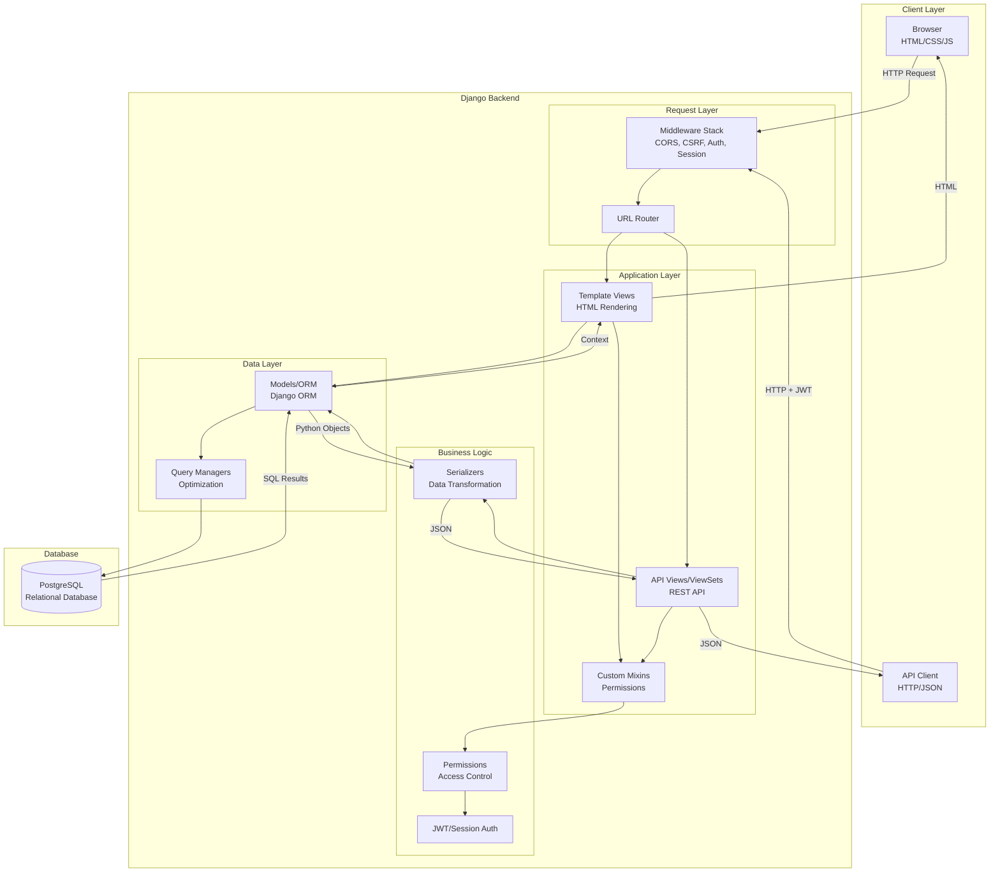
```mermaid
graph TB
    subgraph "Client Layer"
        Browser[Browser<br/>HTML/CSS/JS]
        API_Client[API Client<br/>HTTP/JSON]
    end
    
    subgraph "Django Backend"
        subgraph "Request Layer"
            Router[URL Router]
            Middleware[Middleware Stack<br/>CORS, CSRF, Auth, Session]
        end
        
        subgraph "Application Layer"
            TemplateViews[Template Views<br/>HTML Rendering]
            APIViews[API Views/ViewSets<br/>REST API]
            Mixins[Custom Mixins<br/>Permissions]
        end
        
        subgraph "Business Logic"
            Serializers[Serializers<br/>Data Transformation]
            Permissions[Permissions<br/>Access Control]
            Auth[JWT/Session Auth]
        end
        
        subgraph "Data Layer"
            Models[Models/ORM<br/>Django ORM]
            Managers[Query Managers<br/>Optimization]
        end
    end
    
    subgraph "Database"
        PostgreSQL[(PostgreSQL<br/>Relational Database)]
    end
    
    Browser -->|HTTP Request| Middleware
    API_Client -->|HTTP + JWT| Middleware
    
    Middleware --> Router
    Router --> TemplateViews
    Router --> APIViews
    
    TemplateViews --> Mixins
    APIViews --> Mixins
    
    Mixins --> Permissions
    Permissions --> Auth
    
    TemplateViews --> Models
    APIViews --> Serializers
    Serializers --> Models
    
    Models --> Managers
    Managers --> PostgreSQL
    
    PostgreSQL -->|SQL Results| Models
    Models -->|Python Objects| Serializers
    Models -->|Context| TemplateViews
    
    Serializers -->|JSON| APIViews
    TemplateViews -->|HTML| Browser
    APIViews -->|JSON| API_Client
```


### Модульная структура

**Приложения Django:**

1. **accounts** - Управление пользователями
   - Аутентификация (login, register, logout)
   - Профили пользователей
   - Управление аккаунтом

2. **patients** - Управление пациентами
   - CRUD операции с пациентами
   - Семейные связи
   - Пригласительные коды

3. **staff** - Управление врачами
   - Профили врачей
   - Специализации
   - Личные кабинеты врачей

4. **scheduling** - Система записи
   - Расписание врачей
   - Бронирование приёмов
   - Рецепты и диагнозы

5. **clinic_admin** - Административная панель
   - Управление всеми сущностями
   - Аналитика и статистика

6. **core** - Общие утилиты
   - Mixins для проверки прав
   - Общие view
   - Обработчики ошибок (400, 403, 404, 500, 503)
   - Главная страница приложения


## User-flow

Диаграммы основных сценариев использования системы:

### Пациент: Регистрация и запись на приём

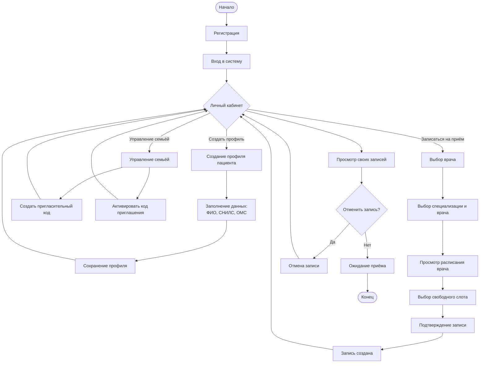
```mermaid
flowchart TD
    Start([Начало]) --> Register[Регистрация]
    Register --> Login[Вход в систему]
    Login --> Dashboard{Личный кабинет}
    Dashboard -->|Создать профиль| CreateProfile[Создание профиля пациента]
    Dashboard -->|Управление семьёй| FamilyMgmt[Управление семьёй]
    Dashboard -->|Записаться на приём| BookAppt[Выбор врача]
    
    CreateProfile --> FillData[Заполнение данных:<br/>ФИО, СНИЛС, ОМС]
    FillData --> SaveProfile[Сохранение профиля]
    SaveProfile --> Dashboard
    
    FamilyMgmt --> CreateInvite[Создать пригласительный код]
    FamilyMgmt --> RedeemCode[Активировать код приглашения]
    CreateInvite --> Dashboard
    RedeemCode --> Dashboard
    
    BookAppt --> SelectDoctor[Выбор специализации и врача]
    SelectDoctor --> ViewSchedule[Просмотр расписания врача]
    ViewSchedule --> SelectSlot[Выбор свободного слота]
    SelectSlot --> ConfirmBooking[Подтверждение записи]
    ConfirmBooking --> Success[Запись создана]
    Success --> Dashboard
    
    Dashboard --> ViewAppointments[Просмотр своих записей]
    ViewAppointments --> CancelAppt{Отменить запись?}
    CancelAppt -->|Да| Cancel[Отмена записи]
    CancelAppt -->|Нет| WaitAppt[Ожидание приёма]
    Cancel --> Dashboard
    WaitAppt --> End([Конец])
```

### Врач: Управление расписанием и ведение приёмов

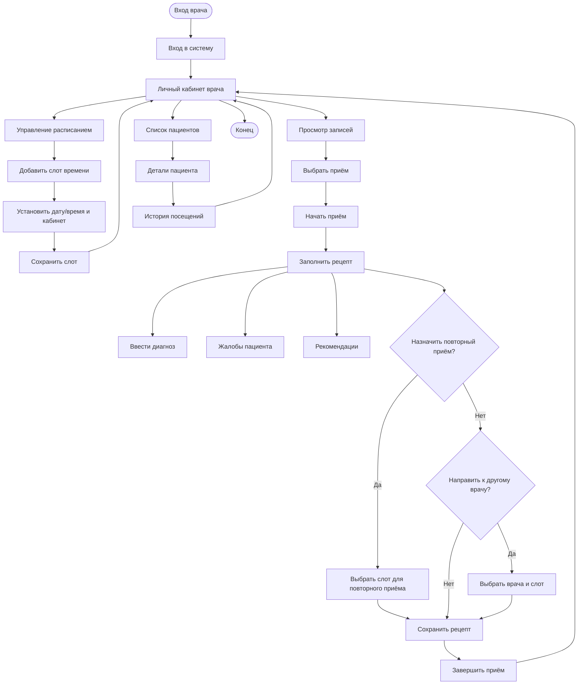
```mermaid
flowchart TD
    Start([Вход врача]) --> DoctorLogin[Вход в систему]
    DoctorLogin --> DoctorDashboard[Личный кабинет врача]
    
    DoctorDashboard --> ManageSchedule[Управление расписанием]
    DoctorDashboard --> ViewAppointments[Просмотр записей]
    DoctorDashboard --> ViewPatients[Список пациентов]
    
    ManageSchedule --> AddSlot[Добавить слот времени]
    AddSlot --> SetDateTime[Установить дату/время и кабинет]
    SetDateTime --> SaveSlot[Сохранить слот]
    SaveSlot --> DoctorDashboard
    
    ViewAppointments --> SelectAppt[Выбрать приём]
    SelectAppt --> StartAppt[Начать приём]
    StartAppt --> FillRecipe[Заполнить рецепт]
    
    FillRecipe --> EnterDiagnosis[Ввести диагноз]
    FillRecipe --> EnterComplaints[Жалобы пациента]
    FillRecipe --> EnterRecommendations[Рекомендации]
    FillRecipe --> NextAppt{Назначить повторный приём?}
    
    NextAppt -->|Да| SelectNextSlot[Выбрать слот для повторного приёма]
    NextAppt -->|Нет| Referral{Направить к другому врачу?}
    
    SelectNextSlot --> SaveRecipe
    Referral -->|Да| SelectReferralDoc[Выбрать врача и слот]
    Referral -->|Нет| SaveRecipe[Сохранить рецепт]
    
    SelectReferralDoc --> SaveRecipe
    SaveRecipe --> CompleteAppt[Завершить приём]
    CompleteAppt --> DoctorDashboard
    
    ViewPatients --> PatientDetail[Детали пациента]
    PatientDetail --> ViewHistory[История посещений]
    ViewHistory --> DoctorDashboard
    
    DoctorDashboard --> End([Конец])
```

### Администратор: Управление системой

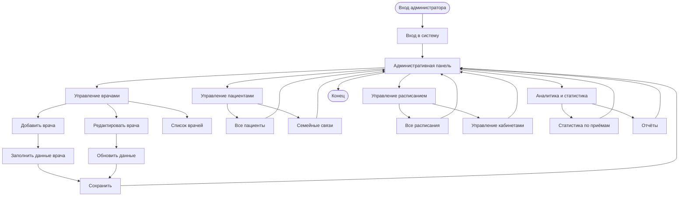
```mermaid
flowchart TD
    Start([Вход администратора]) --> AdminLogin[Вход в систему]
    AdminLogin --> AdminDashboard[Административная панель]
    
    AdminDashboard --> ManageDoctors[Управление врачами]
    AdminDashboard --> ManagePatients[Управление пациентами]
    AdminDashboard --> ManageSchedule[Управление расписанием]
    AdminDashboard --> Analytics[Аналитика и статистика]
    
    ManageDoctors --> AddDoctor[Добавить врача]
    ManageDoctors --> EditDoctor[Редактировать врача]
    ManageDoctors --> ViewDoctors[Список врачей]
    AddDoctor --> FillDoctorData[Заполнить данные врача]
    EditDoctor --> UpdateDoctorData[Обновить данные]
    FillDoctorData --> SaveDoctor[Сохранить]
    UpdateDoctorData --> SaveDoctor
    SaveDoctor --> AdminDashboard
    
    ManagePatients --> ViewAllPatients[Все пациенты]
    ManagePatients --> ViewFamilies[Семейные связи]
    ViewAllPatients --> AdminDashboard
    ViewFamilies --> AdminDashboard
    
    ManageSchedule --> ViewAllSchedules[Все расписания]
    ManageSchedule --> ManageRooms[Управление кабинетами]
    ViewAllSchedules --> AdminDashboard
    ManageRooms --> AdminDashboard
    
    Analytics --> ViewStats[Статистика по приёмам]
    Analytics --> ViewReports[Отчёты]
    ViewStats --> AdminDashboard
    ViewReports --> AdminDashboard
    
    AdminDashboard --> End([Конец])
```

## Схема БД

Диаграмма моделей базы данных:

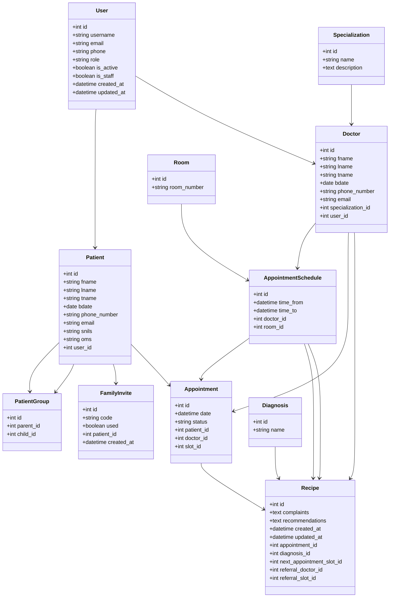
```mermaid
classDiagram
    class User {
        +int id
        +string username
        +string email
        +string phone
        +string role
        +boolean is_active
        +boolean is_staff
        +datetime created_at
        +datetime updated_at
    }
    
    class Patient {
        +int id
        +string fname
        +string lname
        +string tname
        +date bdate
        +string phone_number
        +string email
        +string snils
        +string oms
        +int user_id
    }
    
    class Doctor {
        +int id
        +string fname
        +string lname
        +string tname
        +date bdate
        +string phone_number
        +string email
        +int specialization_id
        +int user_id
    }
    
    class PatientGroup {
        +int id
        +int parent_id
        +int child_id
    }
    
    class FamilyInvite {
        +int id
        +string code
        +boolean used
        +int patient_id
        +datetime created_at
    }
    
    class Specialization {
        +int id
        +string name
        +text description
    }
    
    class Room {
        +int id
        +string room_number
    }
    
    class AppointmentSchedule {
        +int id
        +datetime time_from
        +datetime time_to
        +int doctor_id
        +int room_id
    }
    
    class Appointment {
        +int id
        +datetime date
        +string status
        +int patient_id
        +int doctor_id
        +int slot_id
    }
    
    class Recipe {
        +int id
        +text complaints
        +text recommendations
        +datetime created_at
        +datetime updated_at
        +int appointment_id
        +int diagnosis_id
        +int next_appointment_slot_id
        +int referral_doctor_id
        +int referral_slot_id
    }
    
    class Diagnosis {
        +int id
        +string name
    }
    
    User  -->  Patient
    User  --> Doctor
    Patient  -->  PatientGroup
    Patient  -->  PatientGroup
    Patient  -->  FamilyInvite
    Patient  -->  Appointment
    Specialization  -->  Doctor
    Doctor  -->  AppointmentSchedule
    Doctor  -->  Appointment
    Doctor  -->  Recipe
    Room  -->  AppointmentSchedule
    AppointmentSchedule  --> Appointment
    AppointmentSchedule  -->  Recipe
    AppointmentSchedule  -->  Recipe
    Appointment  -->  Recipe
    Diagnosis  --> Recipe
```

### API Эндпоинты

Система предоставляет как веб-интерфейс (HTML шаблоны), так и REST API для программного доступа к функциональности.

#### Аутентификация и управление аккаунтом (`/accounts/`)

- `GET/POST /accounts/register/` - Регистрация нового пользователя
- `GET/POST /accounts/login/` - Вход в систему
- `GET/POST /accounts/logout/` - Выход из системы
- `GET /accounts/profile/` - Просмотр профиля пользователя
- `GET/POST /accounts/settings/` - Настройки аккаунта
- `POST /accounts/change-login/` - Изменение логина
- `POST /accounts/delete-account/` - Удаление аккаунта
- `GET/POST /accounts/edit-family-member/<id>/` - Редактирование члена семьи

#### Управление пациентами (`/patients/`)

**REST API:**
- `GET /patients/api/` - Список пациентов (требуется аутентификация)
- `POST /patients/api/` - Создание профиля пациента
- `GET /patients/api/<id>/` - Детали пациента
- `PUT/PATCH /patients/api/<id>/` - Обновление данных пациента
- `DELETE /patients/api/<id>/` - Удаление пациента

**Веб-интерфейс:**
- `GET/POST /patients/create_html/` - Создание профиля пациента (HTML форма)
- `GET /patients/manage_html/` - Управление семьёй
- `POST /patients/family/invite/` - Создание пригласительного кода
- `POST /patients/family/redeem/` - Активация пригласительного кода
- `POST /patients/family/remove/` - Удаление члена семьи

#### Управление врачами (`/staff/`)

**REST API:**
- `GET /staff/api/doctors/` - Список врачей
- `POST /staff/api/doctors/` - Создание профиля врача
- `GET /staff/api/doctors/<id>/` - Детали врача
- `PUT/PATCH /staff/api/doctors/<id>/` - Обновление данных врача
- `DELETE /staff/api/doctors/<id>/` - Удаление врача
- `GET /staff/api/specializations/` - Список специализаций
- `POST /staff/api/specializations/` - Создание специализации

**Веб-интерфейс:**
- `GET /staff/home/` - Личный кабинет врача
- `GET /staff/profile/` - Профиль врача
- `GET /staff/patients/` - Список пациентов врача
- `GET /staff/patients/<id>/` - Детали пациента
- `GET /staff/doctors/` - Список всех врачей
- `GET /staff/doctors/<id>/` - Детали врача

#### Система записи на приёмы (`/scheduling/`)

- `GET/POST /scheduling/book/` - Запись на приём
- `GET /scheduling/doctor/<id>/` - Расписание врача
- `POST /scheduling/doctor/<id>/add-timeslot/` - Добавление временного слота (врач)
- `GET/POST /scheduling/book-for-other/` - Запись на приём для другого пациента
- `POST /scheduling/appointment/<id>/status/` - Изменение статуса приёма
- `GET /scheduling/appointment/<id>/` - Детали приёма
- `GET /scheduling/referral-slots/<doctor_id>/` - Получение слотов для направления
- `GET/POST /scheduling/appointment/<id>/offer-account/` - Предложение создания аккаунта
- `GET /scheduling/appointment/<id>/info/` - Информация о приёме
- `POST /scheduling/appointment/<id>/cancel/` - Отмена приёма
- `POST /scheduling/appointment/<id>/update-patient/` - Обновление пациента в приёме
- `POST /scheduling/slot/<slot_id>/book/` - Бронирование слота
- `POST /scheduling/appointment/<appointment_id>/change-patient/` - Изменение пациента в забронированном приёме

#### Административная панель (`/admin-panel/`)

**Управление пациентами:**
- `GET /admin-panel/patients/` - Список всех пациентов
- `GET/POST /admin-panel/patients/create/` - Создание пациента
- `GET /admin-panel/patients/<id>/` - Детали пациента
- `GET/POST /admin-panel/patients/<id>/edit/` - Редактирование пациента
- `POST /admin-panel/patients/<id>/delete/` - Удаление пациента
- `GET/POST /admin-panel/patients/<id>/book/` - Запись пациента на приём

**Управление семьями:**
- `GET /admin-panel/families/` - Список семей
- `GET/POST /admin-panel/families/create/` - Создание семьи
- `GET /admin-panel/families/<id>/` - Детали семьи
- `POST /admin-panel/families/<id>/add-member/` - Добавление члена семьи
- `POST /admin-panel/families/<id>/remove-member/` - Удаление члена семьи

**Управление врачами:**
- `GET /admin-panel/doctors/` - Список врачей
- `GET/POST /admin-panel/doctors/create/` - Создание врача
- `GET /admin-panel/doctors/<id>/` - Детали врача
- `GET/POST /admin-panel/doctors/<id>/edit/` - Редактирование врача
- `POST /admin-panel/doctors/<id>/delete/` - Удаление врача

**Расписание и приёмы:**
- `GET /admin-panel/schedule/` - Расписание клиники
- `POST /admin-panel/appointments/update-status/` - Обновление статуса приёма
- `GET/POST /admin-panel/appointments/<id>/results/` - Результаты приёма (рецепт, диагноз)

**Аналитика:**
- `GET /admin-panel/` - Главная панель администратора
- `GET /admin-panel/analytics/` - Аналитика и статистика


### Демонстрация функционала     

Ниже представлены скриншоты основных возможностей системы ClinicSirius:

#### Главная страница и авторизация

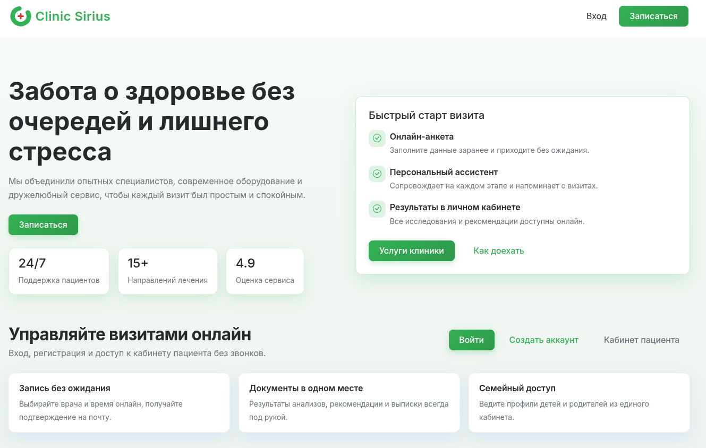
*Главная страница системы ClinicSirius с информацией о клинике и возможностью входа в систему*

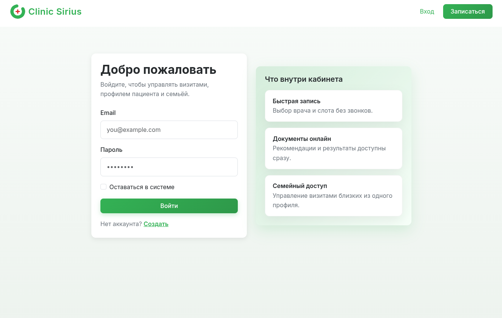
*Страница авторизации пользователей с полями для ввода email и пароля*

#### Функциональность пациента

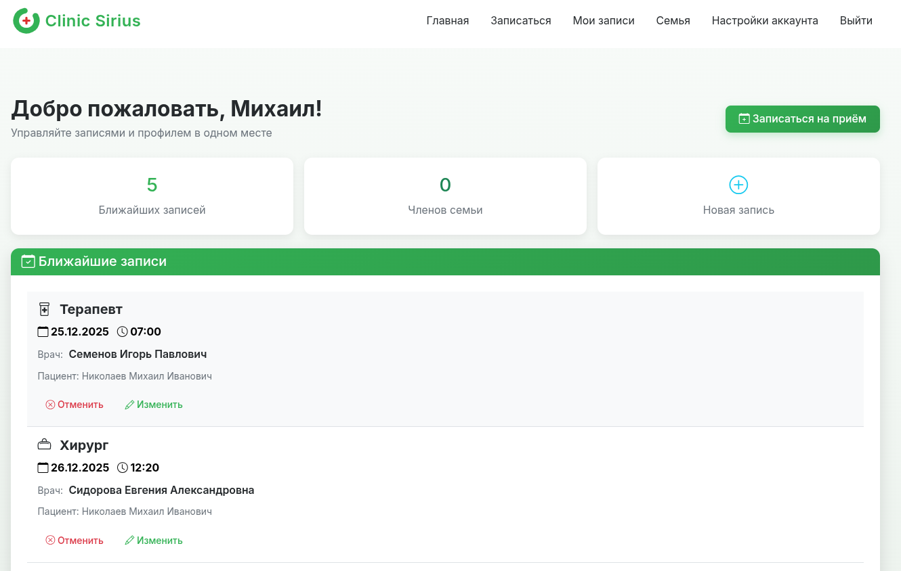
*Дэшборд пациента*

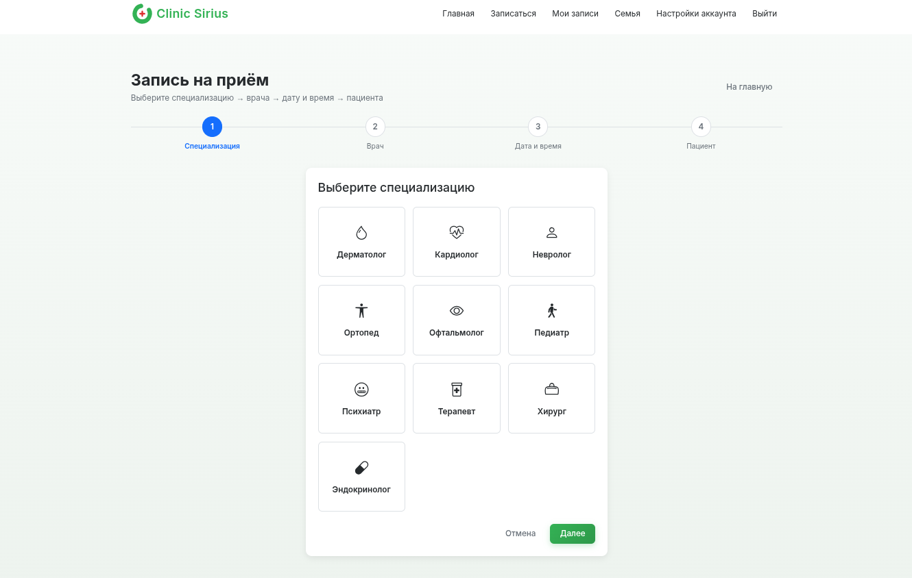
*Пункт выбора специализации при записи на прием*

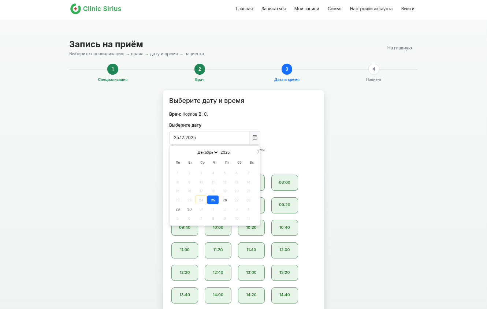
*Возможности удобного выбора даты и окна*

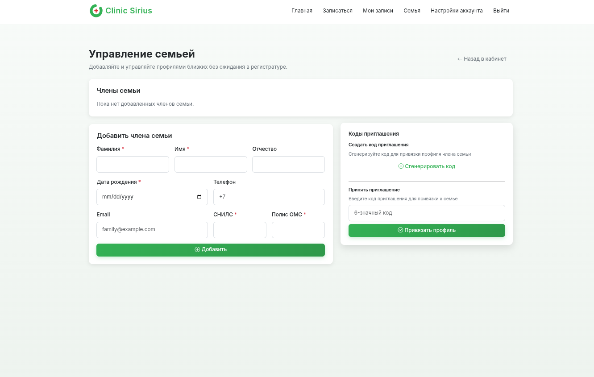
*Интерфейс управления семейными связями: создание пригласительных кодов и добавление членов семьи*

#### Функциональность доктора

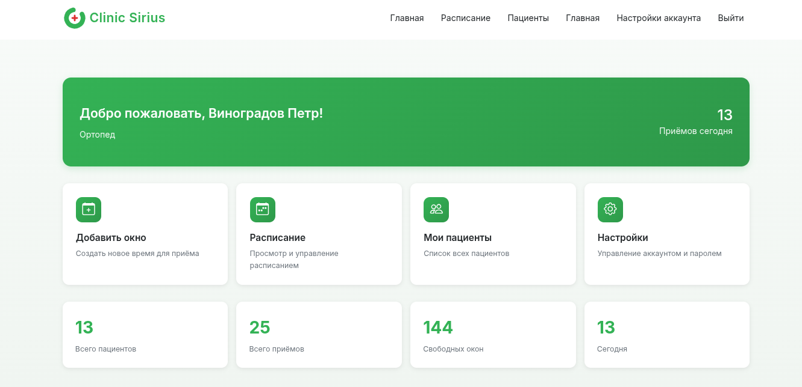
*Дэшборд доктора*

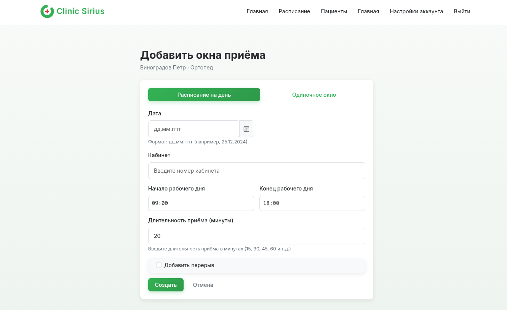
*Добавление окон в рассписание*

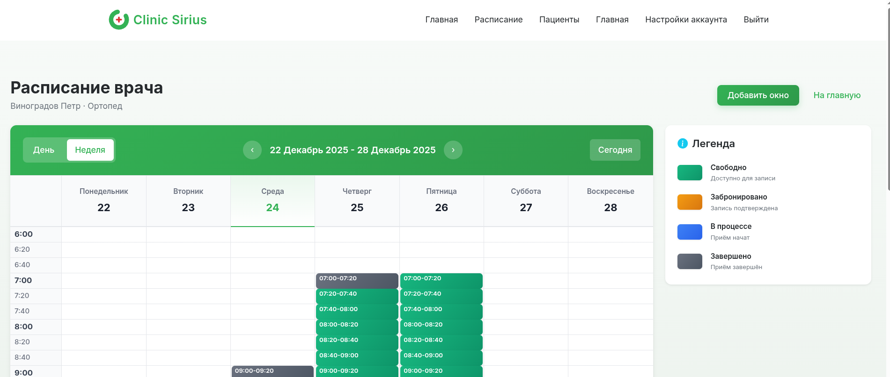
*Календарь-рассписание врача*

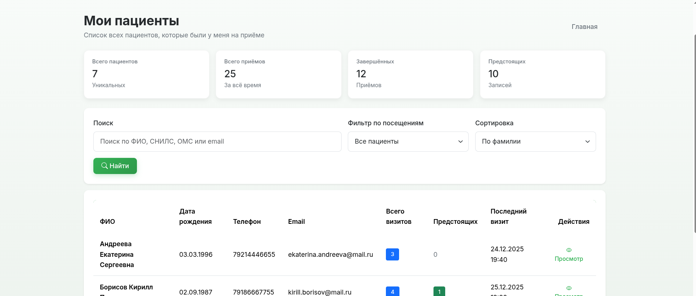
*Список пациентов, которые хоть раз были у него (с историей посещения)*

#### Функциональность администратора

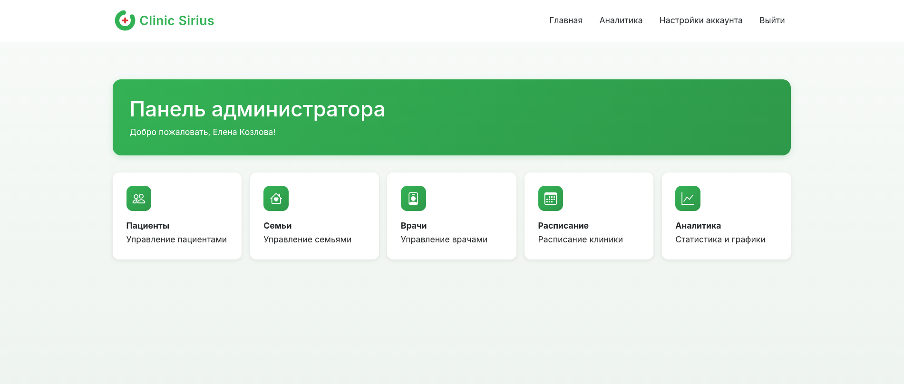
*Дэшборд админа*

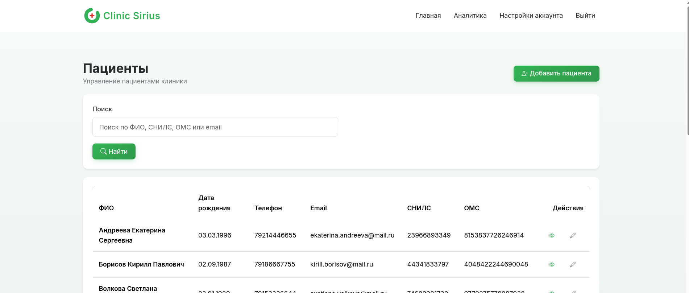
*Просмотр пациентов + их CRUD*

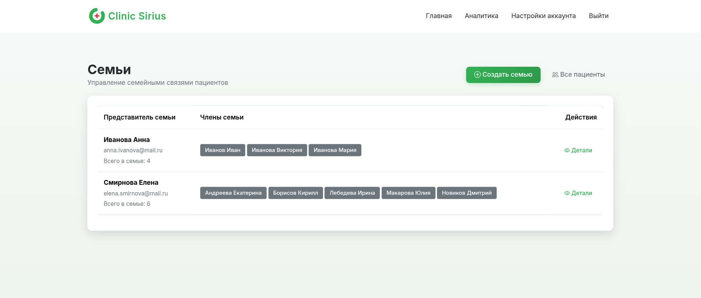
*Просмотр семей + их CRUD*

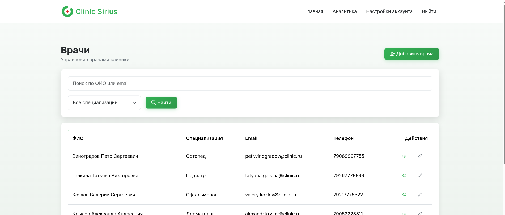
*Просмотр врачей + их CRUD*

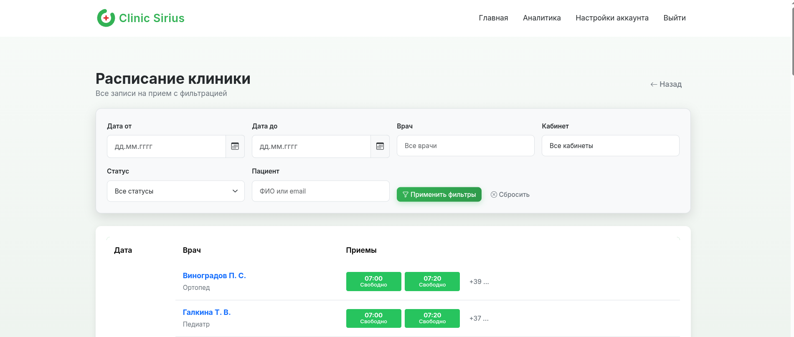
*Просмотр рассписания клиники*

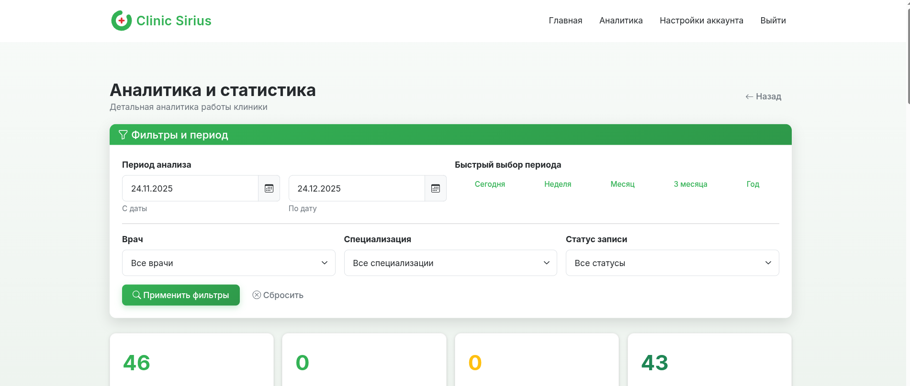
*Статистика и аналитика*

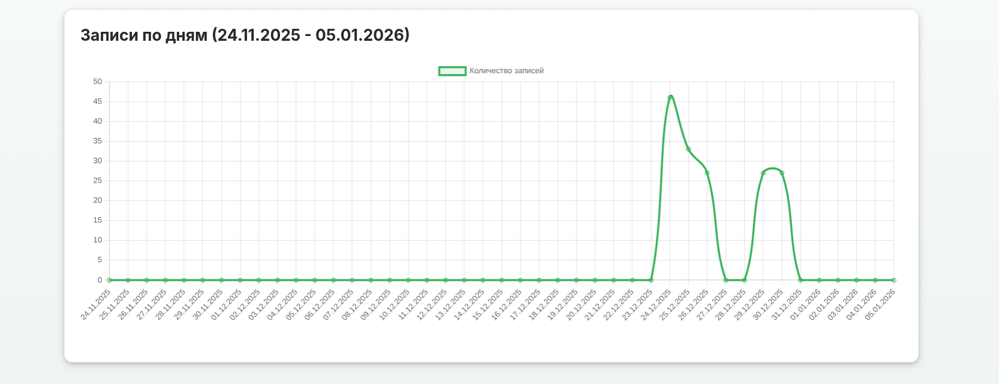
*График посещения приемов*

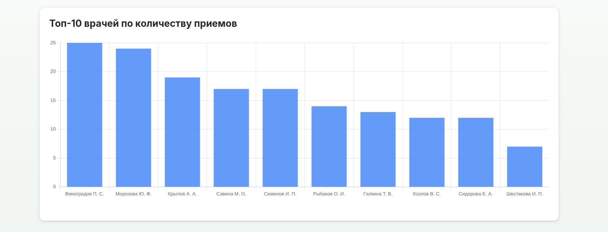
*ТОП-10 врачей по приемам*

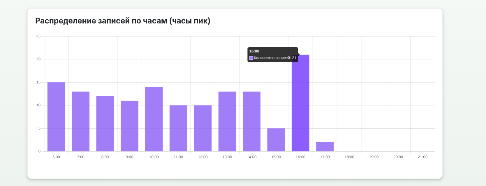
*Анализ пиковых часов*

### Тестовые данные

После инициализации базы данных (загрузки `database_init.sql` и создания пользователей) доступны следующие тестовые учетные записи. **Для всех пользователей используется общий пароль: `Pass123$`**

#### Администраторы (2)

1. **Волков Дмитрий**
   - Email: `dmitry.volkov@clinic.ru`
   - Username: `dmitry.volkov`

2. **Козлова Елена**
   - Email: `elena.kozlova@clinic.ru`
   - Username: `elena.kozlova`

#### Врачи (5)

1. **Семенов Игорь Павлович** (Терапевт)
   - Email: `igor.semenov@clinic.ru`

2. **Сидорова Евгения Александровна** (Хирург)
   - Email: `evgenia.sidorova@clinic.ru`

3. **Козлов Валерий Сергеевич** (Офтальмолог)
   - Email: `valery.kozlov@clinic.ru`

4. **Савина Марина Олеговна** (Кардиолог)
   - Email: `marina.savina@clinic.ru`

5. **Рыбаков Олег Иванович** (Невролог)
   - Email: `oleg.rybakov@clinic.ru`

#### Пациенты (7)

1. **Иванова Анна Сергеевна**
   - Email: `anna.ivanova@mail.ru`

2. **Иванов Иван Алексеевич**
   - Email: `ivan.petrov@mail.ru`

3. **Смирнова Елена Игоревна**
   - Email: `elena.smirnova@mail.ru`

4. **Кузнецов Олег Владимирович**
   - Email: `oleg.kuznetsov@mail.ru`

5. **Иванова Мария Ивановна**
   - Email: `maria.sokolova@mail.ru`

6. **Попов Сергей Петрович**
   - Email: `sergey.popov@mail.ru`

7. **Лебедева Ирина Олеговна**
   - Email: `irina.lebedeva@mail.ru`
